# Lead Core architecture

```text
Browser / Postman
  -> app.js (request ID, JSON size limit, session loading)
  -> Route -> authentication/role/database middleware
  -> Controller -> Service (validation, ownership, workflow/query)
  -> Mongoose Model -> MongoDB
  <- explicit DTO <- JSON response

GET / or /login -> indexRoutes -> loadSession -> homeController -> shared EJS -> HTML
Errors -> errorHandler -> JSON for /api, EJS for page requests
```

The controller translates HTTP inputs/outputs. The service holds reusable business decisions. A Mongoose model defines storage and provides database operations; it does not decide who may approve an article. A DTO is an explicitly chosen response object: public callers never receive raw Article or User documents.



## Directory responsibilities

| Directory | Responsibility |
| --- | --- |
| `config` | Environment validation, MongoDB connection, shared article categories/limits |
| `routes` | Existing home, auth, User, private workspace and article endpoint mappings |
| `middleware` | Request IDs, session lookup, authentication/roles, DB guard, 404 and centralized errors |
| `controllers` | Read request inputs, call services, choose JSON/status or existing EJS templates |
| `services` | Password/session/User operations and Article visibility/workflow rules |
| `models` | User, Session and Article schemas/indexes |
| `utils` | Small validation, cookie, logging, DTO, authorization and pagination helpers |
| `views`, `public` | Shared EJS shell, Login page, base CSS and login/session/logout browser behavior |
| `scripts`, `tests` | Local maintenance and repeatable isolated checks |
| `docs` | Stable API contracts and student/team explanations |

## Runtime and sessions

Importing `app.js` only constructs Express; it does not connect or listen. Direct execution validates configuration, connects to MongoDB, then listens. Tests can import the same app and bind a free local port.

After JSON/static handling, `/api` requests pass through `loadSession` in `app.js`. The `/` and `/login` page routes also use that same middleware, once per request. The browser sends `daily_web_session` automatically. Only a SHA-256 digest of its random token is stored in a Session record. A valid, unexpired record loads the current User; services check that user's current role and article ownership. MongoDB survives a Node restart, so the cookie continues to work. See [models](data-models.md).

`loadSession` exposes only the safe User DTO as `res.locals.currentUser` for EJS and sets `Cache-Control: no-store`. It never exposes the session token or password hash to templates. An absent cookie needs no DB query; an expired/revoked cookie is cleared. The shared navigation tolerates missing locals on early errors/unknown page routes; `main.js` then checks the existing session API. Static assets and `/health` do not perform session lookups.

## Article boundaries

`articleQueryService` owns private reads and public reads. Private queries restrict Reporters to their own records in MongoDB. Public queries require approved content plus a publication date, independently of workflow status. Public projections/DTOs exclude working content, editor notes, status and history.

`articleWorkflowService` validates action-specific inputs and performs status-guarded, single-document updates. Approval sets the public snapshot and pushes history in the same atomic operation. There are no transactions, revision counters or simultaneous-edit guarantees. Future clients must serialize saves and finish saving before submitting.

Dates, ownership and workflow status cannot be supplied through general content saves. Start Revision copies the approved snapshot. Hard deletion removes the Article directly; dependent cleanup must be added by feature owners when dependent collections actually exist.

## Frontend integration boundary

Current `/` remains a skeleton, now using the shared header/navigation/footer alongside Login and error pages. `GET /login` renders a form for guests or redirects authenticated users to `/`. `login.js` sends JSON to the existing auth API and returns home on success. `main.js` refreshes the session display and handles Logout. The cookie stays HttpOnly; browser role display is not authorization.

The future full public article page must render the complete approved body in its initial HTML, using the public query service rather than making an internal HTTP request. Ajax will handle feed interactions/comments/autosave. Escape article text with EJS `<%=` or browser `textContent`; this core does not accept article bodies as trusted HTML.

## Errors and logs

Express 5 forwards rejected async controller promises to the existing error handler. API errors use `{ error: { code, message, fields? }, requestId }`. Input shape/IDs use 400, login 401, role 403, hidden/missing resources 404, illegal state/duplicates 409, oversize body 413, field validation 422, unavailable DB 503, sanitized unexpected errors 500.

JSON logs contain timestamp, level, event and selected IDs/status/code/port. They never include request bodies, password hashes, raw session tokens, database URIs or arbitrary error messages. Events cover startup, auth, User mutations and Article transitions/deletion. Frequent working-content saves are not logged individually. Deployment can capture stdout/stderr; no logging framework is required.
